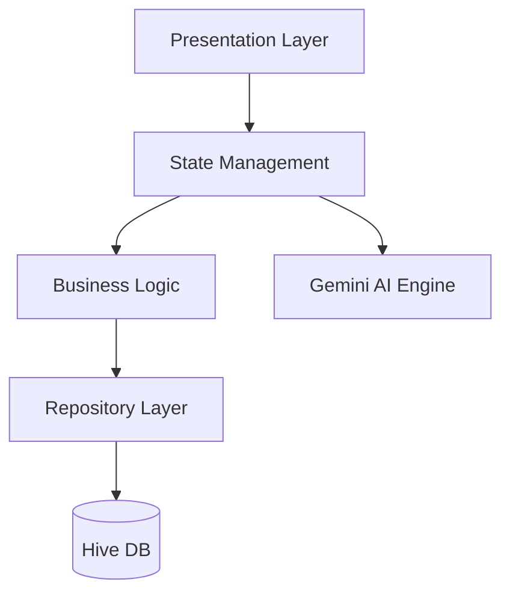

<h1 align="center">🌌 HABITO AI</h1>

<p align="center">
  <strong>Sentient Habit Tracker • AI-Powered Productivity System</strong>
</p>

<p align="center">
  A next-generation Flutter application that combines <b>AI intelligence</b>, 
  <b>gamification</b>, and <b>clean architecture</b> to transform habits into a 
  measurable system of personal growth.
</p>

---

## 🏆 Badges

<p align="center">


[](https://flutter.dev)
[](https://ai.google.dev/)
[](https://docs.hivedb.dev/)
[](https://opensource.org/licenses/MIT)

</p>

---

## 🎥 Demo (What This App Actually Does)

> ⚠️ This section is critical for recruiters — replace with a real recording

### 🎬 Recommended Demo Flow
1. Onboarding experience  
2. Creating a habit  
3. Completing a habit (XP gain)  
4. AI suggestion / nudge  
5. Analytics / progress tracking  

📌 Add your demo here:


---

## 📱 Screens Preview

| Init System | Habit Engine | AI Insights |
|------------|-------------|------------|
|  |  |  |

---

## ⚡ Core Systems

### 🧠 AI Habit Intelligence
- Behavior-based smart nudges  
- Predictive habit scheduling  
- Context-aware onboarding system  

### 🎮 Gamification Engine
- XP & leveling system  
- Rank progression (Novice → Commander)  
- Reward unlocking mechanics  

### 📊 Analytics Engine
- 7-day trend analysis  
- Habit performance insights  
- Behavioral pattern tracking  

### 🛡 Secure Offline Architecture
- Hive local database (NoSQL)  
- `.env` secure API isolation  
- Fully offline-first design  

---

## 🧠 System Architecture (Visual)



---

## 🏗 Architecture Breakdown

| Layer | Responsibility |
|------|---------------|
| Presentation | UI, Widgets, Screens |
| State | Provider (Single Source of Truth) |
| Domain | Business logic & rules |
| Data | Hive storage & repositories |

---

## 📂 Project Structure

```text
lib/
├── core/           # Themes & utilities
├── data/           # Models & storage
├── presentation/   # UI + Providers
└── main.dart
```

---

## ⚙️ Setup Guide

### 1. Clone Repository
```bash
git clone https://github.com/sisodiyaashraf/habito_ai.git
```

### 2. Configure Environment
```env
GEMINI_API_KEY=YOUR_KEY
```

### 3. Install Dependencies
```bash
flutter pub get
```

### 4. Run Application
```bash
flutter run
```

---

## 🚀 Roadmap

- [ ] AI-generated habit reports  
- [ ] Biometric authentication  
- [ ] Focus mode (app blocking)  
- [ ] Multi-persona AI system  
- [ ] Cloud sync  

---

## 💼 Why This Project Stands Out

This is not just a UI project — it demonstrates:

- 🧠 Real-world architecture design  
- ⚙️ Scalable state management  
- 📦 Production-ready structure  
- 🤖 AI integration capability  
- 🎯 Problem-solving mindset  

---

## 🧪 Engineering Highlights

- Clean Architecture implementation  
- Offline-first system design  
- Modular, testable codebase  
- Performance-optimized local DB  
- Separation of concerns (SOLID principles)  

---

## 👨‍💻 Author

**Ashraf**  
Flutter Developer • AI Enthusiast  

- LinkedIn  
- Portfolio  
- Contact  

---

## ⭐ Support & Growth

If you find this project valuable:

- ⭐ Star the repository  
- 🍴 Fork and experiment  
- 🚀 Share with developers  

---

<p align="center">
  <b>“Your habits are a system. This app makes them intelligent.”</b>
</p>
